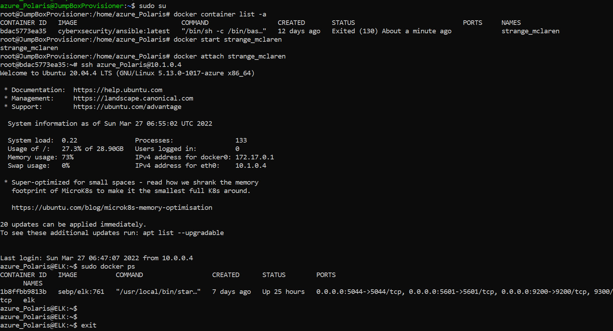

## Automated ELK Stack Deployment

The files in this repository were used to configure the network depicted below.

These files have been tested and used to generate a live ELK deployment on Azure. They can be used to either recreate the entire
deployment pictured above. Alternatively, select portions of the YAML file may be used to install only certain pieces of it, such as Filebeat.

  - [ELK Installation File](https://github.com/Abdelmalek-Aouissa/ELK_Stack_Deployment/blob/main/Ansible/install-elk.yml)

This document contains the following details:
1- Description of the Topology
2- Access Policies
3- ELK Configuration
  3.a- Beats in Use
  3.b- Machines Being Monitored
4- How to Use the Ansible Build

### Description of the Topology

The main purpose of this network is to expose a load-balanced and monitored instance of DVWA, the D*mn Vulnerable Web Application. Load balancing ensures that the application will be highly available, in addition to restricting in-bound access to the network.

In terms of aspects of security, load balancers are Implemented to ensure 'availability' of data, as one major component of the CIA triad. They intelligently distribute loads of traffic between servers. Load Balancers also improve capacity of simultaneous users and reliability of data or applications.
The jumpbox is implemented in an Azure network in order to protect VMs from being exposed to the public internet. By opening specific ports, an administrator can connect to designated VMs within the internal network.

Integrating an ELK server allows users to easily monitor the vulnerable VMs for changes to the data and system logs.
Filebeat is a lightweight logging agent. When installed in a sever, It watches for changes to the various logs, which are then sent to either Elasticsearch for indexing or Logstash for further advanced processing.
Metricbeat, as the name implies, records statistics, called 'Metrics,' about the running applications and services on an operating system. It also sends the collected records to either Elasticsearch or Logstash.

The configuration details of each machine may be found in Table-1:

Table-1
 -----------------------------------------------------------------------------------------------
| Name          | Function             | IP Addresses  ( Private - Public )  | Operating System |
|---------------|----------------------|-------------------------------------|------------------|
| Jumpbox       | Gateway              | 10.0.0.4  - 104.42.159.55           | Linux            |
| Load Balancer | Traffic manager      |           - 40.83.176.20            |                  |
| elk           | Monitoring server    | 10.1.0.4  - 20.231.208.138          | Linux            |
| Web-1         | Webserver            | 10.0.0.5                            | Linux            |
| Web-2         | Webserver            | 10.0.0.6                            | Linux            |
| Web-3         | Webserver            | 10.0.0.7                            | Linux            |
| Workstation   | Remote machine       |           - Home-IP (Local machine) | Windows          |
 -----------------------------------------------------------------------------------------------
 
### Access Policies

The machines on the internal network are not exposed to the public Internet. 

Only the Jumpbox machine can accept connections from the Internet. Access to this machine is only allowed from a designated local machine, 'Workstation', with a specific public IP address, refered to here as 'Home-IP'.
Machines within the network can only be accessed by SSH.

The Jumpbox provisioner, with a public ip address of 104.42.159.55, is allowed to access the ELK VM, via SSH.
The Workstation, local machine, is also allowed to browse into ELK, via HTTP service, over TCP protocol, on port 5601.

A summary of the access policies in place can be found in Table-2:

Table-2
 --------------------------------------------------------------------------------------
|   Name   	    | Publicly Accessible (Yes/No)|         Allowed IP Addresses           |
|---------------|-----------------------------|----------------------------------------|
| Jump Box	    |            Yes              | Home-IP (Local machine) -              |
| Load Balancer |            Yes              | Home-IP (Local machine) - 40.83.176.20 |
| ELK      	    |            Yes              | Home-IP (Local machine) -  10.0.0.4    |
| Web-1    	    |            No               |                         -  10.0.0.4    |
| Web-2    	    |            No               |                         -  10.0.0.4    |
| Web-3   	    |            No               |                         -  10.0.0.4    |
 --------------------------------------------------------------------------------------
 
### Elk Configuration

Ansible was used to automate configuration of the ELK machine. No configuration was performed manually, which is advantageous because
Ansible is able to manage deployments on extended architectures in a short time. Ansible is very flexible that it makes easy the deployment,
configuration and maintenance of new environments across various platforms.

The playbook 'Configure Elk VM with Docker', within install-elk.yml, implements various tasks to:
	1- Install docker.io
	2- Install python3-pip
	3- Install Docker python module
	4- Increase virtual memory
	5- Use more memory
	6- download and launch a docker elk container
	7- Enable docker service
		
The following screenshot displays the result of running `docker ps` after successfully configuring the ELK instance.

### Target Machines & Beats
This ELK server is configured to monitor the following machines:
	- Web-1: 10.0.0.5
	- Web-2: 10.0.0.6
	- Web-3: 10.0.0.7

We have installed the following Beats on the above mentioned machines:
	- Filebeats.
	- Metricbeat.

These Beats enable us to collect information from each of the above mentioned machines:
	- Filebeat collects and shapes data in log forms for easy forwarding and centralization. It then ships
	the logs to elastic search for instance for further analysis. Log files comprise various logs, such as event logs and system logs and so on.
	For example, when a user attemps to log into an account, this would be, in realtime, detected by Filebeat.
		
	- Metricbeat, when installed on a server, collects metric data related to the operating systems, such as the CPU, memory, ..., etc. Metricbeat may also be used to monitor other beats, processes or services running on the server.
		
### Using the Playbook
In order to use the playbook, you will need to have an Ansible control node already configured. Assuming you have such a control node provisioned: 

SSH into the control node and follow the steps below:
	- Copy the 'filebeat-config.yml' file to '/etc/ansible/files/'.
	- Update the 'hosts' file to include the ip adresses of the VMs to be configured:
		[webservers]
		10.0.0.5 ansible_python_interpreter=/usr/bin/python3
		10.0.0.6 ansible_python_interpreter=/usr/bin/python3
		10.0.0.7 ansible_python_interpreter=/usr/bin/python3
		[elk]
		10.1.0.4 ansible_python_interpreter=/usr/bin/python3
		
	- Run the playbook, and navigate to http://[ELK.VM.Public.IP]:5601/app/kibana in order to check that the installation has worked as expected.
                                                
	The following are the main commands that can be used in order to download the playbook, update the files,..., etc.:
		- $ ssh azure_Polaris@104.42.159.55 //
		- azure_Polaris@JumpBoxProvisioner:~$ sudo su
		- root@JumpBoxProvisioner:/home/azure_Polaris# docker ps
		- root@JumpBoxProvisioner:/home/azure_Polaris# docker start strange_mclaren
		- root@JumpBoxProvisioner:/home/azure_Polaris# docker attach strange_mclaren
		- root@bdac5773ea35:/etc/ansible# cd /etc/ansible/
		- root@bdac5773ea35:/etc/ansible# nano hosts
		- curl -L -O https://artifacts.elastic.co/downloads/beats/filebeat/filebeat-7.4.0-amd64.deb > /etc/filebeat/filebeat.yml
		- sudo dpkg -i filebeat-7.4.0-amd64.deb
		- ansible-playbook filebeat-playbook.yml
		- curl localhost/setup.php